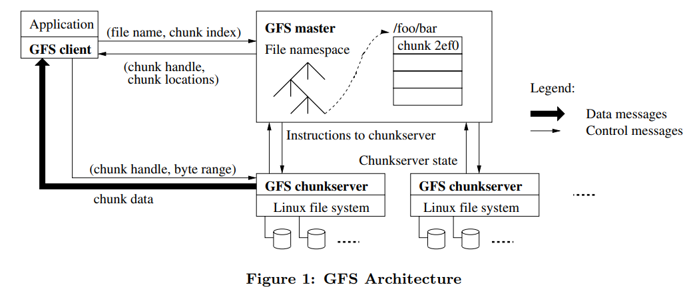
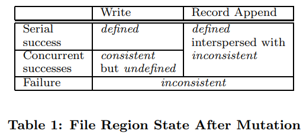
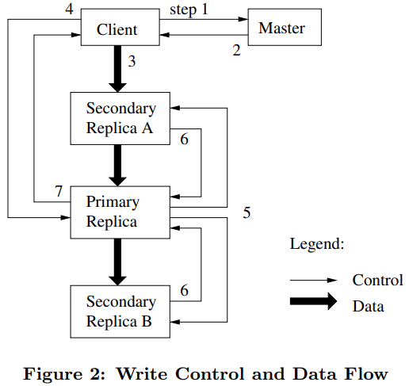

<h1 align="center">The Google File System</h1>

Sanjay Ghemawat, Howard Gobioff, and Shun-Tak Leung

## ABSTRACT

我们设计并实现了 Google GFS 文件系统，一个面向大规模数据密集型应用的、可伸缩的分布式文件系统。 GFS 虽然运行在廉价的普遍硬件设备上，但是它依然了提供灾难冗余的能力，为大量客户机提供了高性能的服务。

虽然 GFS 的设计目标与许多传统的分布式文件系统有很多相同之处，但是，我们的设计还是以我们对自己的应用的负载情况和技术环境的分析为基础的，不管现在还是将来，GFS 和早期的分布式文件系统的设想都有明显的不同。所以我们重新审视了传统文件系统在设计上的折衷选择，衍生出了完全不同的设计思路。

GFS 完全满足了我们对存储的需求。GFS 作为存储平台已经被广泛的部署在 Google 内部，存储我们的服务产生和处理的数据，同时还用于那些需要大规模数据集的研究和开发工作。目前为止，最大的一个集群 利用数千台机器的数千个硬盘，提供了数百 TB 的存储空间，同时为数百个客户机服务。

在本论文中，我们展示了能够支持分布式应用的文件系统接口的扩展，讨论我们设计的许多方面，最后 列出了小规模性能测试以及真实生产系统中性能相关数据。

## 1. INTRODUCTION

为了满足 Google 迅速增长的数据处理需求，我们设计并实现了 Google 文件系统(Google File System – GFS)。GFS 与传统的分布式文件系统有着很多相同的设计目标，比如，性能、可伸缩性、可靠性以及可用性。 但是，我们的设计还基于我们对我们自己的应用的负载情况和技术环境的观察的影响，不管现在还是将来， GFS 和早期文件系统的假设都有明显的不同。所以我们重新审视了传统文件系统在设计上的折衷选择，衍生出了完全不同的设计思路。

首先，**组件失效被认为是常态事件**，而不是意外事件。GFS 包括几百甚至几千台普通的廉价设备组装的存储机器，同时被相当数量的客户机访问。GFS 组件的数量和质量导致在事实上，任何给定时间内都有可能发生某些组件无法工作，某些组件无法从它们目前的失效状态中恢复。我们遇到过各种各样的问题，比如应用程序 bug、操作系统的 bug、人为失误，甚至还有硬盘、内存、连接器、网络以及电源失效等造成的问题。 所以，持续的监控、错误侦测、灾难冗余以及自动恢复的机制必须集成在 GFS 中。

其次，以通常的标准衡量，我们的**文件非常巨大**。数 GB 的文件非常普遍。每个文件通常都包含许多应用程序对象，比如 web 文档。当我们经常需要处理快速增长的、并且由数亿个对象构成的、数以 TB 的数据集时，采用管理数亿个 KB 大小的小文件的方式是非常不明智的，尽管有些文件系统支持这样的管理方式。 因此，设计的假设条件和参数，比如 I/O 操作和 Block 的尺寸都需要重新考虑。

第三，**绝大部分文件的修改是采用在文件尾部追加数据**，而不是覆盖原有数据的方式。对文件的随机写 入操作在实际中几乎不存在。一旦写完之后，对文件的操作就只有读，而且通常是按顺序读。大量的数据符合这些特性，比如：数据分析程序扫描的超大的数据集；正在运行的应用程序生成的连续的数据流；存档的数据；由一台机器生成、另外一台机器处理的中间数据，这些中间数据的处理可能是同时进行的、也可能是后续才处理的。对于这种针对海量文件的访问模式，客户端对数据块缓存是没有意义的，数据的追加操作是性能优化和原子性保证的主要考量因素。

第四，**应用程序和文件系统 API 的协同设计提高了整个系统的灵活性**。比如，我们放松了对 GFS 一致性模型的要求，这样就减轻了文件系统对应用程序的苛刻要求，大大简化了 GFS 的设计。我们引入了原子性的记录追加操作，从而保证多个客户端能够同时进行追加操作，不需要额外的同步操作来保证数据的一致性。 本文后面还有对这些问题的细节的详细讨论。

Google 已经针对不同的应用部署了多套 GFS 集群。最大的一个集群拥有超过 1000 个存储节点，超过 300TB 的硬盘空间，被不同机器上的数百个客户端连续不断的频繁访问。

## 2. DESIGN OVERVIEW

### 2.1 Assumptions

在设计满足我们需求的文件系统时候，我们的设计目标既有机会、又有挑战。之前我们已经提到了一些 需要关注的关键点，这里我们将设计的预期目标的细节展开讨论

**系统由许多廉价的普通组件组成，组件失效是一种常态**。系统必须持续监控自身的状态，它必须将组件失效作为一种常态，能够迅速地侦测、冗余并恢复失效的组件。

**系统存储一定数量的大文件**。我们预期会有几百万文件，文件的大小通常在 100MB 或者以上。数个 GB 大小的文件也是普遍存在，并且要能够被有效的管理。系统也必须支持小文件，但是不需要针对小文件做专门的优化。

**系统的工作负载主要由两种读操作组成：大规模的流式读取和小规模的随机读取**。大规模的流式读取通常一次读取数百 KB 的数据，更常见的是一次读取 1MB 甚至更多的数据。来自同一个客户机的连续操作通常是读取同一个文件中连续的一个区域。小规模的随机读取通常是在文件某个随机的位置读取几个 KB 数据。 如果应用程序对性能非常关注，通常的做法是把小规模的随机读取操作合并并排序，之后按顺序批量读取， 这样就避免了在文件中前后来回的移动读取位置。

**系统的工作负载还包括许多大规模的、顺序的、数据追加方式的写操作**。一般情况下，每次写入的数据的大小和大规模读类似。数据一旦被写入后，文件就很少会被修改了。系统支持小规模的随机位置写入操作， 但是可能效率不高。

**系统必须高效的、行为定义明确的实现多客户端并行追加数据到同一个文件里的语义**。我们的文件通常被用于“生产者-消费者”队列，或者其它多路文件合并操作。通常会有数百个生产者，每个生产者进程运行在一台机器上，同时对一个文件进行追加操作。使用最小的同步开销来实现的原子的多路追加数据操作是必不可少的。文件可以在稍后读取，或者是消费者在追加的操作的同时读取文件。

**高性能的稳定网络带宽远比低延迟重要**。我们的目标程序绝大部分要求能够高速率的、大批量的处理数据，极少有程序对单一的读写操作有严格的响应时间要求。

### 2.2 Interface

**GFS 提供了一套类似传统文件系统的 API 接口函数**，虽然并不是严格按照 POSIX 等标准 API 的形式实现的。文件以分层目录的形式组织，用路径名来标识。我们支持常用的操作，如创建新文件、删除文件、打开文件、关闭文件、读和写文件。

另外，**GFS 提供了快照和记录追加操作**。快照以很低的成本创建一个文件或者目录树的拷贝。记录追加操作允许多个客户端同时对一个文件进行数据追加操作，同时保证每个客户端的追加操作都是原子性的。这对于实现多路结果合并，以及“生产者-消费者”队列非常有用，多个客户端可以在不需要额外的同步锁定的情况下，同时对一个文件追加数据。我们发现这些类型的文件对于构建大型分布应用是非常重要的。快照和记录追加操作将在 3.4 和 3.3 节分别讨论。

### 2.3  Architecture

**一个 GFS 集群包含一个单独的 Master 节点、多台 Chunk 服务器，并且同时被多个客户端访问**，如图 1 所示。所有的这些机器通常都是普通的 Linux 机器，运行着用户级别(user-level)的服务进程。我们可以很容易的把 Chunk 服务器和客户端都放在同一台机器上，前提是机器资源允许，并且我们能够接受不可靠的应用程序代码带来的稳定性降低的风险。

**GFS 存储的文件都被分割成固定大小的 Chunk**。在 Chunk 创建的时候，Master 服务器会给每个 Chunk 分 配一个不变的、全球唯一的 64 位的 Chunk 标识。Chunk 服务器把 Chunk 以 Linux 文件的形式保存在本地硬盘 上，并且根据指定的 Chunk 标识和字节范围来读写块数据。出于可靠性的考虑，每个块都会复制到多个块服务器上。缺省情况下，我们使用 3 个存储复制节点，不过用户可以为不同的文件命名空间设定不同的复制级别。

**Master 节点管理所有的文件系统元数据**。这些元数据包括名字空间、访问控制信息、文件和 Chunk 的映射信息、以及当前 Chunk 的位置信息。Master 节点还管理着系统范围内的活动，比如，Chunk 租约管理、孤儿 Chunk 的回收、以及 Chunk 在 Chunk 服务器之间的迁移。Master 节点使用心跳信息周期地和每个 Chunk 服务器通讯，发送指令到各个 Chunk 服务器并接收 Chunk 服务器的状态信息。

GFS 客户端代码以库的形式被链接到客户程序里。客户端代码实现了 GFS 文件系统的 API 接口函数、 应用程序与 Master 节点和 Chunk 服务器通讯、以及对数据进行读写操作。客户端和 Master 节点的通信只获取元数据，所有的数据操作都是由客户端直接和 Chunk 服务器进行交互的。我们不提供 POSIX 标准的 API 的功 能，因此，GFS API 调用不需要深入到 Linux vnode 级别。

**无论是客户端还是 Chunk 服务器都不需要缓存文件数据**。客户端缓存数据几乎没有什么用处，因为大部分程序要么以流的方式读取一个巨大文件，要么工作集太大根本无法被缓存。无需考虑缓存相关的问题也简化了客户端和整个系统的设计和实现。Chunk 服务器不需要缓存文件数据的原因是，Chunk 以本地文件的方式保存，Linux 操作系统的文件系统缓存会把经常访问的数据缓存在内存中。

### 2.4 Single Master

单一的 Master 节点的策略大大简化了我们的设计。单一的 Master 节点可以通过全局的信息精确定位 Chunk 的位置以及进行复制决策。另外，我们必须减少对 Master 节点的读写，避免 Master 节点成为系统的瓶颈。客户端并不通过 Master 节点读写文件数据。反之，**客户端向 Master 节点询问它应该联系的 Chunk 服务器。 客户端将这些元数据信息缓存一段时间，后续的操作将直接和 Chunk 服务器进行数据读写操作**。

我们利用图 1 解释一下一次简单读取的流程。首先，客户端把文件名和程序指定的字节偏移，根据固定的 Chunk 大小，转换成文件的 Chunk 索引。然后，它把文件名和 Chunk 索引发送给 Master 节点。Master 节点将相应的 Chunk 标识和副本的位置信息发还给客户端。客户端用文件名和 Chunk 索引作为 key 缓存这些信 息。

之后客户端发送请求到其中的一个副本处，一般会选择最近的。请求信息包含了 Chunk 的标识和字节范围。在对这个 Chunk 的后续读取操作中，客户端不必再和 Master 节点通讯了，**除非缓存的元数据信息过期或者文件被重新打开**。实际上，客户端通常会在一次请求中查询多个 Chunk 信息，Master 节点的回应也可能包含了紧跟着这些被请求的 Chunk 后面的 Chunk 的信息。在实际应用中，这些额外的信息在没有任何代价的情况下，避免了客户端和 Master 节点未来可能会发生的几次通讯。

### 2.5 Chunk Size

Chunk 的大小是关键的设计参数之一。我们选择了 64MB，这个尺寸远远大于一般文件系统的 Block size。**每个 Chunk 的副本都以普通 Linux 文件的形式保存在 Chunk 服务器上，只有在需要的时候才扩大。惰性磁盘空间分配策略避免了因内部碎片造成的空间浪费**，内部碎片或许是对选择这么大的 Chunk 尺寸最具争议一点。

选择较大的 Chunk 尺寸有几个重要的优点。

* 它减少了客户端和 Master 节点通讯的需求，因为只需要一次和 Mater 节点的通信就可以获取 Chunk 的位置信息，之后就可以对同一个 Chunk 进行多次的读写操作。这种方式对降低我们的工作负载来说效果显著，因为我们的应用程序通常是连续读写大文件。即使是小规模的随机读取，采用较大的 Chunk 尺寸也带来明显的好处，客户端可以轻松的缓存一个数 TB 的工作数据集所有的 Chunk 位置信息。
* 采用较大的 Chunk 尺寸，客户端能够对一个块进行多次操作，这样就可以通过与 Chunk 服务器保持较长时间的 TCP 连接来减少网络负载。
* 选用较大的 Chunk 尺寸减少了 Master 节点需要保存的元数据的数量。这就允许我们把元数据全部放在内存中，在 2.6.1 节我们会讨论元数据全部放在内存中带来的额外的好处。

另一方面，即使配合惰性空间分配，采用较大的 Chunk 尺寸也有其缺陷。小文件包含较少的 Chunk，甚至只有一个 Chunk。当有许多的客户端对同一个小文件进行多次的访问时，存储这些 Chunk 的 Chunk 服务器就会变成热点。在实际应用中，由于我们的程序通常是连续的读取包含多个 Chunk 的大文件，热点还不是主要的问题。

然而，当我们第一次把 GFS 用于批处理队列系统的时候，热点的问题还是产生了：一个可执行文件在 GFS 上保存为 single-chunk 文件，之后这个可执行文件在数百台机器上同时启动。存放这个可执行文件的几 个 Chunk 服务器被数百个客户端的并发请求访问导致系统局部过载。我们通过使用更大的复制参数来保存可执行文件，以及错开批处理队列系统程序的启动时间的方法解决了这个问题。一个可能的长效解决方案是， 在这种的情况下，允许客户端从其它客户端读取数据。

### 2.6 Metadata

**Master 服务器存储 3 种主要类型的元数据，包括：文件和 Chunk 的命名空间、文件和 Chunk 的对应关系、 每个 Chunk 副本的存放地点**。所有的元数据都保存在 Master 服务器的内存中。**前两种类型的元数据同时也会以记录变更日志的方式记录在操作系统的系统日志文件中**，日志文件存储在本地磁盘上，同时日志会被复制到其它的远程Master服务器上。采用保存变更日志的方式，我们能够简单可靠的更新 Master 服务器的状态， 并且不用担心 Master 服务器崩溃导致数据不一致的风险。Master 服务器不会持久保存 Chunk 位置信息。Master 服务器在启动时，或者有新的 Chunk 服务器加入时，向各个 Chunk 服务器轮询它们所存储的 Chunk 的信息。

#### 2.6.1  In-Memory Data Structures

**因为元数据保存在内存中，所以 Master 服务器的操作速度非常快**。并且，Master 服务器可以在后台简单而高效的周期性扫描自己保存的全部状态信息。这种周期性的状态扫描也用于实现 Chunk 垃圾收集、在 Chunk 服务器失效的时重新复制数据、通过 Chunk 的迁移实现跨 Chunk 服务器的负载均衡以及磁盘使用状况统计等功能。4.3 和 4.4 章节将深入讨论这些行为。

将元数据全部保存在内存中的方法有潜在问题：Chunk 的数量以及整个系统的承载能力都受限于 Master 服务器所拥有的内存大小。但是在实际应用中，这并不是一个严重的问题。Master 服务器只需要不到 64 个字节的元数据就能够管理一个 64MB 的 Chunk。由于大多数文件都包含多个 Chunk，因此绝大多数 Chunk 都是满的，除了文件的最后一个 Chunk 是部分填充的。同样的，每个文件的在命名空间中的数据大小通常在 64 字节以下，因为保存的文件名是用前缀压缩算法压缩过的。

即便是需要支持更大的文件系统，为 Master 服务器增加额外内存的费用是很少的，而通过增加有限的费用，我们就能够把元数据全部保存在内存里，增强了系统的简洁性、可靠性、高性能和灵活性。

#### 2.6.2 Chunk Locations

**Master 服务器并不保存持久化保存哪个 Chunk 服务器存有指定 Chunk 的副本的信息**。Master 服务器只是在启动的时候轮询 Chunk 服务器以获取这些信息。Master 服务器能够保证它持有的信息始终是最新的，因为它控制了所有的 Chunk 位置的分配，而且通过周期性的心跳信息监控 Chunk 服务器的状态。

最初设计时，我们试图把 Chunk 的位置信息持久的保存在 Master 服务器上，但是后来我们发现在启动的时候轮询 Chunk 服务器，之后定期轮询更新的方式更简单。这种设计简化了在有 Chunk 服务器加入集群、离开集群、更名、失效、以及重启的时候，Master 服务器和 Chunk 服务器数据同步的问题。在一个拥有数百台服务器的集群中，这类事件会频繁的发生。

可以从另外一个角度去理解这个设计决策：只有 Chunk 服务器才能最终确定一个 Chunk 是否在它的硬盘 上。我们从没有考虑过在 Master 服务器上维护一个这些信息的全局视图，因为 Chunk 服务器的错误可能会导致 Chunk 自动消失(比如，硬盘损坏了或者无法访问了)，亦或者操作人员可能会重命名一个 Chunk 服务器。

#### 2.6.3 Operation Log

**操作日志包含了关键的元数据变更历史记录**。这对 GFS 非常重要。这不仅仅是因为操作日志是元数据唯一的持久化存储记录，它也作为判断同步操作顺序的逻辑时间基线。文件和 Chunk，连同它们的版本(参考 4.5 节)，都由它们创建的逻辑时间唯一的、永久的标识。

操作日志非常重要，我们必须确保日志文件的完整，确保只有在元数据的变化被持久化后，日志才对客户端是可见的。否则，即使 Chunk 本身没有出现任何问题，我们仍有可能丢失整个文件系统，或者丢失客户端最近的操作。所以，我们会把日志复制到多台远程机器，并且**只有把相应的日志记录写入到本地以及远程机器的硬盘后，才会响应客户端的操作请求**。Master 服务器会收集多个日志记录后批量处理，以减少写入磁盘和复制对系统整体性能的影响。

**Master 服务器在灾难恢复时，通过重演操作日志把文件系统恢复到最近的状态**。为了缩短 Master 启动的时间，我们必须使日志足够小。Master 服务器在日志增长到一定量时对系统状态做一次 Checkpoint，将所 有的状态数据写入一个 Checkpoint 文件。在灾难恢复的时候，Master 服务器就通过从磁盘上读取这个 Checkpoint 文件，以及重演 Checkpoint 之后的有限个日志文件就能够恢复系统。Checkpoint 文件以压缩 B- 树的形式的数据结构存储，可以直接映射到内存，在用于命名空间查询时无需额外的解析。这大大提高了恢复速度，增强了可用性。

由于创建一个 Checkpoint 文件需要一定的时间，所以 Master 服务器的内部状态被组织为一种格式，这种格式要确保在 Checkpoint 过程中不会阻塞正在进行的修改操作。Master 服务器使用独立的线程切换到新的日志文件和创建新的 Checkpoint 文件。新的 Checkpoint 文件包括切换前所有的修改。对于一个包含数百万个文件的集群，创建一个 Checkpoint 文件需要 1 分钟左右的时间。创建完成后，Checkpoint 文件会被写入在本地和远程的硬盘里。

Master 服务器恢复只需要最新的 Checkpoint 文件和后续的日志文件。旧的 Checkpoint 文件和日志文件可以被删除，但是为了应对灾难性的故障，我们通常会多保存一些历史文件。Checkpoint 失败不会对正确性产生任何影响，因为恢复功能的代码可以检测并跳过没有完成的 Checkpoint 文件。

### 2.7 Consistency Model

GFS 具有宽松的一致性模型，这种模型很好地支持了我们高度分布式的应用程序，同时实现起来相对简单且高效。现在我们讨论 GFS 的一致性保证以及它们对应用程序的意义。我们还将重点介绍 GFS 如何维护这些一致性保证，但将详细内容留给本文的其他部分。

#### 2.7.1 Guarantees by GFS

**文件命名空间的修改（例如，文件创建）是原子性的**。它们仅由 Master 节点的控制：命名空间锁提供了原子性和正确性（4.1 章）的保证；**Master 节点的操作日志定义了这些操作在全局的顺序（2.6.3 章）**。

数据修改后文件 region 的状态取决于操作的类型、成功与否、以及是否同步修改。表 1 总结了各种操作的结果。

**如果所有客户端，无论从哪个副本读取，读到的数据都一样，那么我们认为文件 region 是“一致的”；如果对文件的数据修改之后，region 是一致的，并且客户端能够看到写入操作全部的内容，那么这个 region 是“已定义的”。**

当一个数据修改操作成功执行，并且没有受到同时执行的其它写入操作的干扰，那么影响的 region 就是 已定义的（隐含了一致性）：所有的客户端都可以看到写入的内容。在文件相同偏移量处的并行修改操作成功完成之后，region 处于一致的、未定义的状态：所有的客户端看到同样的数据，但是无法读到任何一次写入操作写入的数据（**第 3.1 节末尾有解释**）。通常情况下，文件 region 内包含了来自多个修改操作的、混杂的数据片段。失败的修改操作导致一个 region 处于不一致状态（同时也是未定义的）：不同的客户在不同的时间会看到不同的数据。后面我们将描述应用如何区分已定义和未定义的 region。应用程序没有必要再去细分未定义 region 的不同类型。

数据修改操作分为写入或者记录追加两种。写入操作把数据写在应用程序指定的文件偏移位置上。即使有多个修改操作并行执行时，记录追加操作至少可以把数据原子性的追加到文件中一次，但是偏移位置是由 GFS 选择的（3.3 章）。GFS 返回给客户端一个偏移量，表示了包含了写入记录的、已定义的 region 的起点。 另外，GFS 可能会在文件中间插入填充数据或者重复记录。这些数据占据的文件 region 被认定是不一致的， 这些数据通常比用户数据小的多。

经过了一系列的成功的修改操作之后，GFS 确保被修改的文件 region 是已定义的，并且包含最后一次修改操作写入的数据。GFS 通过以下措施确保上述行为：（a） 对 Chunk 的所有副本的修改操作顺序一致（3.1 章），（b）使用 Chunk 的版本号来检测副本是否因为它所在的 Chunk 服务器宕机（4.5 章）而错过了修改操作而导致其失效。失效的副本不会再进行任何修改操作，Master 服务器也不再返回这个 Chunk 副本的位置信息给客户端。它们会被垃圾收集系统尽快回收。

由于 Chunk 位置信息会被客户端缓存，所以在信息刷新前，客户端有可能从一个失效的副本读取了数据。 在缓存的超时时间和文件下一次被打开的时间之间存在一个时间窗口，文件再次被打开后会清除缓存中与该文件有关的所有 Chunk 位置信息。而且，由于我们的文件大多数都是只进行追加操作的，所以，一个失效的副本通常返回一个提前结束的 Chunk 而不是过期的数据。当一个 Reader 重新尝试并联络 Master 服务器时，它就会立刻得到最新的 Chunk 位置信息。

即使在修改操作成功执行很长时间之后，组件的失效也可能损坏或者删除数据。GFS 通过 Master 服务器和所有 Chunk 服务器的定期“握手”来找到失效的 Chunk 服务器，并且使用 Checksum 来校验数据是否损坏（5.2 章）。一旦发现问题，数据要尽快利用有效的副本进行恢复（4.3 章）。只有当一个 Chunk 的所有副本在 GFS 检测到错误并采取应对措施之前全部丢失，这个 Chunk 才会不可逆转的丢失。在一般情况下 GFS 的反应时间是几分钟。即使在这种情况下，Chunk 也只是不可用了，而不是损坏了：应用程序会收到明确的错误信息而不是损坏的数据。

#### 2.7.2 Implications for Applications

使用 GFS 的应用程序可以利用一些简单技术实现这个宽松的一致性模型，这些技术也用来实现一些其它的目标功能，包括：尽量采用追加写入而不是覆盖写、Checkpoint、自验证的写入操作、自标识的记录。

在实际应用中，我们所有的应用程序对文件的写入操作都是尽量采用数据追加方式，而不是覆盖方式。 一种典型的应用，应用程序从头到尾写入数据，生成了一个文件。写入所有数据之后，应用程序自动将文件改名为一个永久保存的文件名，或者周期性的作 Checkpoint，记录成功写入了多少数据。Checkpoint 文件可以包含程序级别的校验和。Readers 仅校验并处理上个 Checkpoint 之后产生的文件 region，这些文件 region 的状态一定是已定义的。这个方法满足了我们一致性和并发处理的要求。追加写入比随机位置写入更加有效率， 对应用程序的失败处理更具有弹性。Checkpoint 可以让 Writer 以渐进的方式重新开始，并且可以防止 Reader 处理已经被成功写入，但是从应用程序的角度来看还并未完成的数据。

我们再来分析另一种典型的应用。许多应用程序并行的追加数据到同一个文件，比如进行结果的合并或者是一个生产者-消费者队列。记录追加方式的“至少一次追加”的特性保证了 Writer 的输出。Readers 使用下面的方法来处理偶然性的填充数据和重复内容。Writers 在每条写入的记录中都包含了额外的信息，例如 Checksum，用来验证它的有效性。**Reader 可以利用 Checksum 识别和抛弃额外的填充数据和记录片段**。如果应用不能容忍偶尔的重复内容(比如，如果这些重复数据触发了非幂等操作)，可以用记录的唯一标识符来过滤它们，这些唯一标识符通常用于命名程序中处理的实体对象，例如 web 文档。这些记录 I/O 功能都包含在我们的程序共享的库中，并且适用于 Google 内部的其它的文件接口实现。所以，相同序列的记录，加上一些偶尔出现的重复数据，都被分发到 Reader 了。

## 3. SYSTEM INTERACTIONS

我们在设计这个系统时，一个重要的原则是最小化所有操作和 Master 节点的交互。带着这样的设计理念，我们现在描述一下客户机、Master 服务器和 Chunk 服务器如何进行交互，以实现数据修改操作、原子的记录追加操作以及快照功能。

### 3.1 Leases and Mutation Order

变更是一个会改变 Chunk 内容或者元数据的操作，比如写入操作或者记录追加操作。变更操作会在 Chunk 的所有副本上执行。我们**使用租约（lease）机制来保持多个副本间变更顺序的一致性**。Master 节点为 Chunk 的一个副本建立一个租约，我们把这个副本叫做主 Chunk。**主 Chunk 对 Chunk 的所有更改操作进行序列化， 所有的副本都遵从这个序列进行修改操作**。因此，修改操作全局的顺序首先由 Master 节点选择的租约的顺序决定，然后由租约中主 Chunk 分配的序列号决定。

设计租约机制的目的是为了最小化 Master 节点的管理负担。租约的初始超时设置为 60 秒。不过，只要 Chunk 被修改了，主 Chunk 就可以申请更长的租期，通常会得到 Master 节点的确认并收到租约延长的时间。 这些租约延长请求和批准的信息通常都是附加在 Master 节点和 Chunk 服务器之间的心跳消息中来传递。有时 Master 节点会试图提前取消租约（例如，Master 节点想取消在一个已经被改名的文件上的修改操作）。即使 Master 节点和主 Chunk 失去联系，它仍然可以安全地在旧的租约到期后和另外一个 Chunk 副本签订新的租约。

在图 2 中，我们依据步骤编号，展现写入操作的控制流程。

客户机向 Master 节点询问哪一个 Chunk 服务器持有当前的租约，以及其它副本的位置。如果没有一个 Chunk 持有租约，Master 节点就选择其中一个副本建立一个租约（这个步骤在图上没有显示）。

Master 节点将主 Chunk 的标识符以及其它副本（又称为 secondary 副本、二级副本）的位置返回给客户机。客户机缓存这些数据以便后续的操作。只有在主 Chunk 不可用，或者主 Chunk 回复信息表明它已不再持有租约或者文件被重新打开是，客户机才需要重新跟 Master 节点联系。

客户机把数据推送到所有的副本上。客户机可以以任意的顺序推送数据。Chunk 服务器接收到数据并保存在它的内部 LRU 缓存中，一直到数据被使用或者过期交换出去。由于数据流的网络传输负载非常高，通过分离数据流和控制流，我们可以基于网络拓扑情况对数据流进行规划，提高系统性能，而不用去理会哪个 Chunk 服务器保存了主 Chunk。3.2 章节会进一步讨论这点。

当所有的副本都确认接收到了数据，客户机发送写请求到主 Chunk 服务器。这个请求标识了早前推送到所有副本的数据。**主 Chunk 为接收到的所有操作分配连续的序列号，这些操作可能来自不同的客户机，序列号保证了操作顺序执行**。它以序列号的顺序把操作应用到它自己的本地状态中（alex 注：也就是在本地执行这些操作，这句话按字面翻译有点费解，也许应该翻译为“它顺序执行这些操作，并更新自己的状态”）。

主 Chunk 把写请求传递到所有的二级副本。每个二级副本依照主 Chunk 分配的序列号以相同的顺序执行这些操作。

所有的二级副本回复主 Chunk，它们已经完成了操作。

主 Chunk 服务器回复客户机。任何副本产生的任何错误都会返回给客户机。在出现错误的情况下，写 入操作可能在主 Chunk 和一些二级副本执行成功。（如果操作在主 Chunk 上失败了，操作就不会被分配序列号，也不会被传递。）客户端的请求被确认为失败，被修改的 region 处于不一致的状态。我们的**客户机代码通过重复执行失败的操作来处理这样的错误**。在从头开始重复执行之前，客户机会先从步骤（3）到步骤（7） 做几次尝试。

**如果应用程序一次写入的数据量很大，或者数据跨越了多个 Chunk，GFS 客户机代码会把它们分成多个写操作**。这些操作都遵循前面描述的控制流程，但是可能会被其它客户机上同时进行的操作打断或者覆盖。 因此，**共享的文件 region 的尾部可能包含来自不同客户机的数据片段**，尽管如此，由于这些分解后的写入操在所有的副本上都以相同的顺序执行完成，**这种情况下 Chunk 的所有副本都是一致的**。这使文件 region 处于 2.7 节描述的一致的、但是未定义的状态。

### 3.2 Data Flow

为了提高网络效率，我们采取了把数据流和控制流分开的措施。在控制流从客户机到主 Chunk、然后再到所有二级副本的同时，数据以管道的方式，顺序的沿着一个精心选择的 Chunk 服务器链推送。我们的目标 是充分利用每台机器的带宽，避免网络瓶颈和高延时的连接，最小化推送所有数据的延时

为了充分利用每台机器的带宽，数据沿着一个 Chunk 服务器链顺序的推送，而不是以其它拓扑形式分散推送（例如，树型拓扑结构）。线性推送模式下，每台机器所有的出口带宽都用于以最快的速度传输数据，而不是在多个接受者之间分配带宽。

为了尽可能的避免出现网络瓶颈和高延迟的链接（eg，inter-switch 最有可能出现类似问题），每台机器都尽量的在网络拓扑中选择一台还没有接收到数据的、离自己最近的机器作为目标推送数据。假设客户机把数据从 Chunk 服务器 S1 推送到 S4。它把数据推送到最近的 Chunk 服务器 S1。S1 把数据推送到 S2，因为 S2 和 S4 中最接近的机器是 S2。同样的，S2 把数据传递给 S3 和 S4 之间更近的机器，依次类推推送下去。我们 的网络拓扑非常简单，通过 IP 地址就可以计算出节点的“距离”。

最后，我们利用基于 TCP 连接的、管道式数据推送方式来最小化延迟。Chunk 服务器接收到数据后， 马上开始向前推送。管道方式的数据推送对我们帮助很大，因为我们采用全双工的交换网络。接收到数据后立刻向前推送不会降低接收的速度。在没有网络拥塞的情况下，传送 B 字节的数据到 R 个副本的理想时间是 B/T+RL ，T 是网络的吞吐量，L 是在两台机器数据传输的延迟。通常情况下，我们的网络连接速度是 100Mbps （T），L 将远小于 1ms。因此，1MB 的数据在理想情况下 80ms 左右就能分发出去。

### 3.3 Atomic Record Appends

GFS 提供了一种原子的数据追加操作–记录追加。传统方式的写入操作，客户程序会指定数据写入的偏移量。对同一个 region 的并行写入操作不是串行的：region 尾部可能会包含多个不同客户机写入的数据片段。 **使用记录追加，客户机只需要指定要写入的数据。GFS 保证至少有一次原子的写入操作成功执行（即写入一个顺序的 byte 流），写入的数据追加到 GFS 指定的偏移位置上，之后 GFS 返回这个偏移量给客户机**。这类似于在 Unix 操作系统编程环境中，对以 O_APPEND 模式打开的文件，多个并发写操作在没有竞态条件时的行为。

记录追加在我们的分布式应用中非常频繁的使用，在这些分布式应用中，通常有很多的客户机并行地对同一个文件追加写入数据。如果我们采用传统方式的文件写入操作，客户机需要额外的复杂、昂贵的同步机制， 例如使用一个分布式的锁管理器。在我们的工作中，这样的文件通常用于多个生产者/单一消费者的队列系统， 或者是合并来自多个客户机的数据的结果文件。

记录追加是一种修改操作，它也遵循 3.1 节描述的控制流程，除了在主 Chunk 有些额外的控制逻辑。客户机把数据推送给文件最后一个 Chunk 的所有副本，之后发送请求给主 Chunk。**主 Chunk 会检查这次记录追加操作是否会使 Chunk 超过最大尺寸（64MB）。如果超过了最大尺寸，主 Chunk 首先将当前 Chunk 填充到最大尺寸，之后通知所有二级副本做同样的操作，然后回复客户机要求其对下一个 Chunk 重新进行记录追加操作**（记录追加与普通的写入操作的不同点就在这里）。记录追加的数据大小严格控制在 Chunk 最大尺寸的 1/4，这样即使在最坏情况下，数据碎片的数量仍然在可控的范围。通常情况下追加的记录不超过 Chunk 的最大尺寸，主 Chunk 把数据追加到自己的副本内， 然后通知二级副本把数据写在跟主 Chunk 一样的位置上，最后回复客户机操作成功。

如果记录追加操作在任何一个副本上失败了，客户端就需要重新进行操作。重新进行记录追加的结果是， 同一个 Chunk 的不同副本可能包含不同的数据–重复包含一个记录全部或者部分的数据。GFS 并不保证 Chunk 的所有副本在字节级别是完全一致的。它只保证数据作为一个整体原子的被至少写入一次。这个特性可以通过简单观察推导出来：如果操作成功执行，数据一定已经写入到 Chunk 的所有副本的相同偏移位置上。这之后，所有的副本至少都到了记录尾部的长度，任何后续的记录都会追加到更大的偏移地址，或者是不同的 Chunk 上，即使其它的 Chunk 副本被 Master 节点选为了主 Chunk。就我们的一致性模型而言，**记录追加操作成功写入数据的 region 是已定义的（因此也是一致的），反之则是不一致的（因此也就是未定义的）**。正如我们在 2.7.2 节讨论的，我们的程序可以处理不一致的区域。

### 3.4 Snapshot

快照操作几乎可以瞬间完成对一个文件或者目录树（“源”）做一个拷贝，并且几乎不会对正在进行的其它操作造成任何干扰。我们的用户可以使用快照迅速的创建一个巨大的数据集的分支拷贝（而且经常是递归的拷贝拷贝），或者是在做实验性的数据操作之前，使用快照操作备份当前状态，这样之后就可以轻松的提交或者回滚到备份时的状态。

就像 AFS（alex 注：AFS，即 Andrew File System，一种分布式文件系统），我们用标准的 copy-on-write 技术实现快照。当 Master 节点收到一个快照请求，它首先取消作快照的文件的所有 Chunk 的租约。这个措施保证了后续对这些 Chunk 的写操作都必须与 Master 交互以找到租约持有者。这就给 Master 节点一个率先创建 Chunk 的新拷贝的机会。

租约取消或者过期之后，Master 节点把这个操作以日志的方式记录到硬盘上。然后，Master 节点通过复制源文件或者目录的元数据的方式，把这条日志记录的变化反映到保存在内存的状态中。新创建的快照文件和源文件指向完全相同的 Chunk 地址。

在快照操作之后，当客户机第一次想写入数据到 Chunk C，它首先会发送一个请求到 Master 节点查询当前的租约持有者。Master 节点注意到 Chunk C 的引用计数超过了 1。Master 节点不会马上回复客户机的请求， 而是选择一个新的 Chunk 句柄 C。之后，Master 节点要求每个拥有 Chunk C 当前副本的 Chunk 服务器创建一 个叫做 C 的新 Chunk。通过在源 Chunk 所在 Chunk 服务器上创建新的 Chunk，我们确保数据在本地而不是通过网络复制（我们的硬盘比我们的 100Mb 以太网大约快 3 倍）。从这点来讲，请求的处理方式和任何其它 Chunk 没什么不同：Master 节点确保新 Chunk C 的一个副本拥有租约，之后回复客户机，客户机得到回复后就可以正常的写这个 Chunk，而不必理会它是从一个已存在的 Chunk 克隆出来的。

## 4. MASTER OPERATION 

**Master 节点执行所有的命名空间操作**。此外，它还**管理着整个系统里所有 Chunk 的副本：它决定 Chunk 的存储位置，创建新 Chunk 和它的副本**，协调各种各样的系统活动以保证 Chunk 被完全复制，在所有的 Chunk 服务器之间的进行**负载均衡**，**回收不再使用的存储空间**。本节我们讨论上述的主题。

### 4.1 Namespace Management and Locking

Master 节点的很多操作会花费很长的时间：比如，快照操作必须取消 Chunk 服务器上快照所涉及的所有的 Chunk 的租约。我们不希望在这些操作的运行时，延缓了其它的 Master 节点的操作。因此，我们允许多个操作同时进行，使用名称空间的 region 上的锁来保证执行的正确顺序。

不同于许多传统文件系统，GFS 没有针对每个目录实现能够列出目录下所有文件的数据结构。GFS 也不支持文件或者目录的链接（即 Unix 术语中的硬链接或者符号链接）。在逻辑上，GFS 的名称空间就是一个全路径和元数据映射关系的查找表。利用前缀压缩，这个表可以高效的存储在内存中。**在存储名称空间的树型结构上，每个节点（绝对路径的文件名或绝对路径的目录名）都有一个关联的读写锁**。

**每个 Master 节点的操作在开始之前都要获得一系列的锁**。通常情况下，如果一个操作涉及/d1/d2/… /dn/leaf，那么操作首先要获得目录/d1，/d1/d2，…，/d1/d2/…/dn 的读锁，以及/d1/d2/…/dn/leaf 的读写锁。注意，根据操作的不同，leaf 可以是一个文件，也可以是一个目录。

现在，我们演示一下在 /home/user 被快照到/save/user 的时候，锁机制如何防止创建文件/home/user/foo。 快照操作获取/home 和/save 的读取锁，以及/home/user 和/save/user 的写入锁。文件创建操作获得 /home 和 /home/user 的读取锁，以及/home/user/foo 的写入锁。这两个操作要顺序执行，因为它们试图获取的 /home/user 的锁是相互冲突。文件创建操作不需要获取父目录的写入锁，因为这里没有“目录”，或者类似 inode 等用来禁止修改的数据结构。文件名的读取锁足以防止父目录被删除。

**采用这种锁方案的优点是支持对同一目录的并行操作**。比如，可以再同一个目录下同时创建多个文件： 每一个操作都获取一个目录名的上的读取锁和文件名上的写入锁。目录名的读取锁足以的防止目录被删除、 改名以及被快照。文件名的写入锁序列化文件创建操作，确保不会多次创建同名的文件。

因为名称空间可能有很多节点，**读写锁采用惰性分配策略，在不再使用的时候立刻被删除**。同样，**锁的获取也要依据一个全局一致的顺序来避免死锁：首先按名称空间的层次排序，在同一个层次内按字典顺序排序**。

### 4.2 Replica Placement

GFS 集群是高度分布式的多层布局结构，而不是平面结构。典型的拓扑结构是有数百个 Chunk 服务器安装在许多机架上。Chunk 服务器被来自同一或者不同机架上的数百个客户机轮流访问。不同机架上的两台机器间的通讯可能跨越一个或多个网络交换机。另外，机架的出入带宽可能比机架内所有机器加和在一起的带宽要小。多层分布架构对数据灵活性、可靠性以及可用性方面提出特有的挑战。

**Chunk 副本位置选择的策略服务两大目标：最大化数据可靠性和可用性，最大化网络带宽利用率**。为了 实现这两个目的，仅仅是在多台机器上分别存储这些副本是不够的，这只能预防硬盘损坏或者机器失效带来的影响，以及最大化每台机器的网络带宽利用率。我们必须在多个机架间分布储存 Chunk 的副本。这保证 Chunk 的一些副本在整个机架被破坏或掉线（比如，共享资源，如电源或者网络交换机造成的问题）的情况下依然存在且保持可用状态。这还意味着在网络流量方面，尤其是针对 Chunk 的读操作，能够有效利用多个机架的整合带宽。另一方面，写操作必须和多个机架上的设备进行网络通信，但是这个代价是我们愿意付出的。

### 4.3 Creation, Re-replication, Rebalancing

Chunk 的副本有三个用途：Chunk 创建，重新复制和重新负载均衡

1）我们希望在低于平均硬盘使用率的 Chunk 服务器上存储新的副本。这样的做法最终能够平衡 Chunk 服务器之间的硬盘使用率。 

2）我们希望限制在每个 Chunk 服务器上“最近”的 Chunk 创建操作的次数。虽然创建操作本身是廉价的，但是创建操作也意味着随之会有大量的写入数据的操作，因为 Chunk 在 Writer 真正写入数据的时候才被创建，而在我们的“追加一次，读取多次”的工作模式下，Chunk 一旦写入成功之后就会变为只读的了。 

3）如上所述，我们希望把 Chunk 的副本分布在多个机架之间。

当 Chunk 的有效副本数量少于用户指定的复制因数的时候，Master 节点会重新复制它。这可能是由几个原因引起的：一个 Chunk 服务器不可用了，Chunk 服务器报告它所存储的一个副本损坏了，Chunk 服务器的 一个磁盘因为错误不可用了，或者 Chunk 副本的复制因数提高了。每个需要被重新复制的 Chunk 都会根据几个因素进行排序。一个因素是 Chunk 现有副本数量和复制因数相差多少。例如，丢失两个副本的 Chunk 比丢失一个副本的 Chunk 有更高的优先级。另外，我们优先重新复制活跃（live）文件的 Chunk 而不是最近刚被 删除的文件的 Chunk（查看 4.4 节）。最后，为了最小化失效的 Chunk 对正在运行的应用程序的影响，我们提高会阻塞客户机程序处理流程的 Chunk 的优先级。

Master 节点选择优先级最高的 Chunk，然后命令某个 Chunk 服务器直接从可用的副本”克隆”一个副本出来。选择新副本的位置的策略和创建时类似：平衡硬盘使用率、限制同一台 Chunk 服务器上的正在进行的克隆操作的数量、在机架间分布副本。为了防止克隆产生的网络流量大大超过客户机的流量，Master 节点对整个集群和每个 Chunk 服务器上的同时进行的克隆操作的数量都进行了限制。另外，Chunk 服务器通过调节它对源 Chunk 服务器读请求的频率来限制它用于克隆操作的带宽。

最后，Master 服务器周期性地对副本进行重新负载均衡：它检查当前的副本分布情况，然后移动副本以便更好的利用硬盘空间、更有效的进行负载均衡。而且在这个过程中，Master 服务器逐渐的填满一个新的 Chunk 服务器，而不是在短时间内用新的 Chunk 填满它，以至于过载。新副本的存储位置选择策略和上面讨论的相同。另外，Master 节点必须选择哪个副本要被移走。通常情况，Master 节点移走那些剩余空间低于平均值的 Chunk 服务器上的副本，从而平衡系统整体的硬盘使用率。

### 4.4 Garbage Collection

GFS 在文件删除后不会立刻回收可用的物理空间。GFS 空间回收采用惰性的策略，只在文件和 Chunk 级的常规垃圾收集时进行。我们发现这个方法使系统更简单、更可靠。

#### 4.4.1 Mechanism

当一个文件被应用程序删除时，Master 节点像对待其它修改操作一样，立刻把删除操作以日志的方式记录下来。但是，Master 节点并不马上回收资源，而是把文件名改为一个包含删除时间戳的、隐藏的名字。当 Master 节点对文件系统命名空间做常规扫描的时候，它会删除所有三天前的隐藏文件（这个时间间隔是可以设置的）。直到文件被真正删除，它们仍旧可以用新的特殊的名字读取，也可以通过把隐藏文件改名为正常显示的文件名的方式“反删除”。当隐藏文件被从名称空间中删除，Master 服务器内存中保存的这个文件的相关元数据才会被删除。这也有效的切断了文件和它包含的所有 Chunk 的连接。

**在对 Chunk 名字空间做类似的常规扫描时，Master 节点找到孤儿 Chunk**（不被任何文件包含的 Chunk） **并删除它们的元数据**。Chunk 服务器在和 Master 节点交互的心跳信息中，报告它拥有的 Chunk 子集的信息， Master 节点回复 Chunk 服务器哪些 Chunk 在 Master 节点保存的元数据中已经不存在了。Chunk 服务器可以任意删除这些 Chunk 的副本。

#### 4.4.2 Discussion

虽然分布式垃圾回收在编程语言领域是一个需要复杂的方案才能解决的难题，但是在 GFS 系统中是非常简单的。我们可以轻易的得到 Chunk 的所有引用：它们都只存储在 Master 服务器上的文件到 chunks 的映射表中。 我们也可以很轻易的得到所有 Chunk 的副本：它们都以 Linux 文件的形式存储在 Chunk 服务器的指定目录下。**所有 Master 节点不能识别的副本都是“垃圾”**。

延迟垃圾回收在空间回收方面相比直接删除有几个优势。

* 对于组件失效是常态的大规模分布式系统， 垃圾回收方式简单可靠。Chunk 可能在某些 Chunk 服务器创建成功，某些 Chunk 服务器上创建失败，失败的副本处于无法被 Master 节点识别的状态。副本删除消息可能丢失，Master 节点必须重新发送失败的删除消息， 包括自身的和 Chunk 服务器的。垃圾回收提供了一致的、可靠的清除无用副本的方法。
* 垃圾回收把存储空间的回收操作合并到 Master 节点规律性的后台活动中，比如，例行扫描和与 Chunk 服务器握手等。因此，操作被批量的执行，开销会被分散。另外，垃圾回收在 Master 节点相对空闲的时候完成。这样 Master 节点就可以给那些需要快速反应的客户机请求提供更快捷的响应。
* 延缓存储空间回收为意外的、不可逆转的删除操作提供了安全保障。

根据我们的使用经验，延迟回收空间的主要问题是，延迟回收会阻碍用户调优存储空间的使用，特别是当存储空间比较紧缺的时候。当应用程序重复创建和删除临时文件时，释放的存储空间不能马上重用。我们通过显式的再次删除一个已经被删除的文件的方式加速空间回收的速度。我们允许用户为命名空间的不同部分设定不同的复制和回收策略。例如，用户可以指定某些目录树下面的文件不做复制，删除的文件被即时的、 不可恢复的从文件系统移除。

### 4.5 Stale Replica Detection

当 Chunk 服务器失效时，Chunk 的副本有可能因错失了一些修改操作而过期失效。**Master 节点保存了每 个 Chunk 的版本号，用来区分当前的副本和过期副本**。

无论何时，**只要 Master 节点和 Chunk 签订一个新的租约，它就增加 Chunk 的版本号，然后通知最新的副本**。Master 节点和这些副本都把新的版本号记录在它们持久化存储的状态信息中。这个动作发生在任何客户机得到通知以前，因此也是对这个 Chunk 开始写之前。如果某个副本所在的 Chunk 服务器正好处于失效状态，那么副本的版本号就不会被增加。Master 节点在这个 Chunk 服务器重新启动，并且向 Master 节点报告它拥有的 Chunk 的集合以及相应的版本号的时候，就会检测出它包含过期的 Chunk。如果 Master 节点看到一个比它记录的版本号更高的版本号，Master 节点会认为它和 Chunk 服务器签订租约的操作失败了，因此会选择更高的版本号作为当前的版本号。

**Master 节点在例行的垃圾回收过程中移除所有的过期失效副本**。在此之前，**Master 节点在回复客户机的 Chunk 信息请求的时候，简单的认为那些过期的块根本就不存在**。另外一重保障措施是，Master 节点在通知客户机哪个 Chunk 服务器持有租约、或者指示 Chunk 服务器从哪个 Chunk 服务器进行克隆时，消息中都附带了 Chunk 的版本号。**客户机或者 Chunk 服务器在执行操作时都会验证版本号以确保总是访问当前版本的数据**。

## 5. FAULT TOLERANCE AND DIAGNOSIS

我们在设计 GFS 时遇到的最大挑战之一是如何处理频繁发生的组件失效。组件的数量和质量让这些问题出现的频率远远超过一般系统意外发生的频率：我们不能完全依赖机器的稳定性，也不能完全相信硬盘的可靠性。组件的失效可能造成系统不可用，更糟糕的是，还可能产生不完整的数据。我们讨论我们如何应对频繁发生的组件失效，以及当组件失效不可避免的发生时，用 GFS 自带工具诊断系统故障。

### 5.1 High Availability

在 GFS 集群的数百个服务器之中，在任何给定的时间必定会有些服务器是不可用的。我们使用两条简单但是有效的策略保证整个系统的高可用性：快速恢复和复制。

#### 5.1.1 Fast Recovery

**不管 Master 服务器和 Chunk 服务器是如何关闭的，它们都被设计为可以在数秒钟内恢复它们的状态并重新启动**。事实上，我们并不区分正常关闭和异常关闭；通常，我们通过直接 kill 掉进程来关闭服务器。客户机和其它的服务器会感觉到系统有点颠簸，正在发出的请求会超时，需要重新连接到重启后的服务器，然后重试这个请求。6.6.2 章节记录了实测的启动时间。

#### 5.1.2 Chunk Replication

正如之前讨论的，**每个 Chunk 都被复制到不同机架上的不同的 Chunk 服务器上**。用户可以为文件命名空间的不同部分设定不同的复制级别。缺省是 3。当有 Chunk 服务器离线了，或者通过 checksum 校验（参考 5.2 节）发现了已经损坏的数据，**Master 节点通过克隆已有的副本保证每个 Chunk 都被完整复制**。虽然 Chunk 复制策略对我们非常有效，但是我们也在寻找其它形式的跨服务器的冗余解决方案，比如使用奇偶校验、或者 Erasure codes [^27]来解决我们日益增长的只读存储需求。我们的系统主要的工作负载是追加方式的写入和读取操作，很少有随机的写入操作，因此，我们认为在我们这个高度解耦合的系统架构下实现这些复杂的冗余方案很有挑战性，但并非不可实现。

#### 5.1.3 Master Replication

为了保证 Master 服务器的可靠性，**Master 服务器的状态也要复制**。Master 服务器所有的操作日志和 checkpoint 文件都被复制到多台机器上。对 Master 服务器状态的修改操作能够提交成功的前提是，操作日志写入到 Master 服务器的备份节点和本机的磁盘。简单说来，一个 Master 服务进程负责所有的修改操作，包括后台的服务，比如垃圾回收等改变系统内部状态活动。当它失效的时，几乎可以立刻重新启动。如果 Master 进程所在的机器或者磁盘失效了，处于 GFS 系统外部的监控进程会在其它的存有完整操作日志的机器上启动一 个新的 Master 进程。客户端使用规范的名字访问 Master（比如 gfs-test）节点，这个名字类似 DNS 别名，因此也就可以在 Master 进程转到别的机器上执行时，通过更改别名的实际指向访问新的 Master 节点。

此外，**GFS 中还有“影子”Master 服务器，这些“影子”服务器在“主”Master 服务器宕机的时候提供文件系统的只读访问**。它们是影子，而不是镜像，所以**它们的数据可能比“主”Master 服务器更新要慢**， 通常是不到 1 秒。对于那些不经常改变的文件、或者那些允许获取的数据有少量过期的应用程序，“影子” Master 服务器能够提高读取的效率。事实上，因为文件内容是从 Chunk 服务器上读取的，因此，应用程序不会发现过期的文件内容。在这个短暂的时间窗口内，过期的可能是文件的元数据，比如目录的内容或者访问控制信息。

“影子”Master 服务器为了保持自身状态是最新的，它会读取一份当前正在进行的操作的日志副本，并 且依照和主 Master 服务器完全相同的顺序来更改内部的数据结构。和主 Master 服务器一样，“影子”Master 服务器在启动的时候也会从 Chunk 服务器轮询数据（之后定期拉数据），数据中包括了 Chunk 副本的位置信息；“影子”Master 服务器也会定期和 Chunk 服务器“握手”来确定它们的状态。在主 Master 服务器因创建和删除副本导致副本位置信息更新时，“影子”Master 服务器才和主 Master 服务器通信来更新自身状态。

### 5.2 Data Integrity

**每个 Chunk 服务器都使用 Checksum 来检查保存的数据是否损坏**。考虑到一个 GFS 集群通常都有好几百台机器、几千块硬盘，磁盘损坏导致数据在读写过程中损坏或者丢失是非常常见的（第 7 节讲了一个原因）。 我们可以通过别的 Chunk 副本来解决数据损坏问题，但是跨越 Chunk 服务器比较副本来检查数据是否损坏很不实际。另外，GFS 允许有歧义的副本存在：GFS 修改操作的语义，特别是早先讨论过的原子纪录追加的操作，并不保证副本完全相同(alex 注：副本不是 byte-wise 完全一致的)。因此，每个 Chunk 服务器必须独立维护 Checksum 来校验自己的副本的完整性。

我们把每个 Chunk 都分成 64KB 大小的块。每个块都对应一个 32 位的 Checksum。和其它元数据一样， **Checksum 与其它的用户数据是分开的，并且保存在内存和硬盘上，同时也记录操作日志**。

**对于读操作来说，在把数据返回给客户端或者其它的 Chunk 服务器之前，Chunk 服务器会校验读取操作涉及的范围内的块的 Checksum**。因此 Chunk 服务器不会把错误数据传递到其它的机器上。如果发生某个块的 Checksum 不正确，Chunk 服务器返回给请求者一个错误信息，并且通知 Master 服务器这个错误。作为回应， 请求者应当从其它副本读取数据，Master 服务器也会从其它副本克隆数据进行恢复。当一个新的副本就绪后， Master 服务器通知副本错误的 Chunk 服务器删掉错误的副本。

**Checksum 对读操作的性能影响很小**，可以基于几个原因来分析一下。因为大部分的读操作都至少要读取几个块，而我们只需要读取一小部分额外的相关数据进行校验。GFS 客户端代码通过每次把读取操作都对齐在 Checksum block 的边界上，进一步减少了这些额外的读取操作的负面影响。另外，在 Chunk 服务器上， Checksum 的查找和比较不需要 I/O 操作，Checksum 的计算可以和 I/O 操作同时进行。

**Checksum 的计算针对在 Chunk 尾部的追加写入操作做了高度优化**（与之对应的是覆盖现有数据的写入操作），因为这类操作在我们的工作中占了很大比例。我们只增量更新最后一个不完整的块的 Checksum，并且用所有的追加来的新 Checksum 块来计算新的 Checksum。即使是最后一个不完整的 Checksum 块已经损坏了，而且我们不能够马上检查出来，由于新的 Checksum 和已有数据不吻合，在下次对这个块进行读取操作的时候， 会检查出数据已经损坏了。

相比之下，**如果写操作覆盖已经存在的一个范围内的 Chunk，我们必须读取和校验被覆盖的第一个和最后一个块，然后再执行写操作**；操作完成之后再重新计算和写入新的 Checksum。如果我们不校验第一个和最后一个被写的块，那么新的 Checksum 可能会隐藏没有被覆盖区域内的数据错误。

**在 Chunk 服务器空闲的时候，它会扫描和校验每个不活动的 Chunk 的内容。这使得我们能够发现很少被读取的 Chunk 是否完整**。一旦发现有 Chunk 的数据损坏，Master 可以创建一个新的、正确的副本，然后把损坏的副本删除掉。这个机制也避免了非活动的、已损坏的 Chunk 欺骗 Master 节点，使 Master 节点认为它们已经有了足够多的副本了。

### 5.3 Diagnostic Tools

详尽的、深入细节的诊断日志，在问题隔离、调试、以及性能分析等方面给我们带来无法估量的帮助， 同时也只需要很小的开销。没有日志的帮助，我们很难理解短暂的、不重复的机器之间的消息交互。GFS 的服务器会产生大量的日志，记录了大量关键的事件（比如，Chunk 服务器启动和关闭）以及所有的 RPC 的请求和回复。这些诊断日志可以随意删除，对系统的正确运行不造成任何影响。然而，我们在存储空间允许的情况下会尽量的保存这些日志。

RPC 日志包含了网络上发生的所有请求和响应的详细记录，但是不包括读写的文件数据。通过匹配请求与回应，以及收集不同机器上的 RPC 日志记录，我们可以重演所有的消息交互来诊断问题。日志还用来跟踪负载测试和性能分析。

日志对性能的影响很小（远小于它带来的好处），因为这些日志的写入方式是顺序的、异步的。最近发生的事件日志保存在内存中，可用于持续不断的在线监控。

## 6. MEASUREMENTS

本节中，我们将使用一些小规模基准测试来展现 GFS 系统架构和实现上的一些固有瓶颈，还有些来自 Google 内部使用的真实的 GFS 集群的基准数据。

### 6.1 Micro-benchmarks

Omit

#### 6.1.1 Reads

Omit

#### 6.1.2 Writes

Omit

#### 6.1.3 Record Appends

Omit

### 6.2 Real World Clusters

Omit

#### 6.2.1 Storage

Omit

#### 6.2.2 Metadata

Omit

#### 6.2.3 Read and Write Rates

Omit

#### 6.2.4 Master Load

Omit

#### 6.2.5 Recovery Time

Omit

### 6.3 Workload Breakdown

Omit

#### 6.3.1 Methodology and Caveats

Omit

#### 6.3.2 Chunkserver Workload

Omit

#### 6.3.3 Appends versus Writes

Omit

#### 6.3.4 Master Workload

Omit

## 7. EXPERIENCES

在建造和部署 GFS 的过程中，我们经历了各种各样的问题，有些是操作上的，有些是技术上的

起初，GFS 被设想为我们的生产系统的后端文件系统。随着时间推移，在 GFS 的使用中逐步的增加了对 研究和开发任务的支持。我们开始增加一些小的功能，比如权限和配额，到了现在，GFS 已经初步支持了这 些功能。虽然我们生产系统是严格受控的，但是用户层却不总是这样的。需要更多的基础架构来防止用户间 的相互干扰。

我们最大的问题是磁盘以及和 Linux 相关的问题。很多磁盘都声称它们支持某个范围内的 Linux IDE 硬盘 驱动程序，但是实际应用中反映出来的情况却不是这样，它们只支持最新的驱动。因为协议版本很接近，所 以大部分磁盘都可以用，但是偶尔也会有由于协议不匹配，导致驱动和内核对于驱动器的状态判断失误。这会导致数据因为内核中的问题意外的被破坏了。这个问题促使我们使用 Checksum 来校验数据，同时我们也修 改内核来处理这些因为协议不匹配带来的问题。

较早的时候，我们在使用 Linux 2.2 内核时遇到了些问题，主要是 fsync()的效率问题。它的效率与文件 的大小而不是文件修改部分的大小有关。这在我们的操作日志文件过大时给出了难题，尤其是在我们尚未实 现 Checkpoint 的时候。我们费了很大的力气用同步写来解决这个问题，但是最后还是移植到了 Linux2.4 内核 上。

另一个和 Linux 相关的问题是单个读写锁的问题，也就是说，在某一个地址空间的任意一个线程都必须 在从磁盘 page in（读锁）的时候先 hold 住，或者在 mmap()调用（写锁）的时候改写地址空间。我们发现即 使我们的系统负载很轻的情况下也会有偶尔的超时，我们花费了很多的精力去查找资源的瓶颈或者硬件的问 题。最后我们终于发现这个单个锁在磁盘线程交换以前映射的数据到磁盘的时候，锁住了当前的网络线程， 阻止它把新数据映射到内存。由于我们的性能主要受限于网络接口，而不是内存 copy 的带宽，因此，我们用 pread()替代 mmap()，用了一个额外的 copy 动作来解决这个问题。

尽管偶尔还是有其它的问题，Linux 的开放源代码还是使我们能够快速探究和理解系统的行为。在适当的 时候，我们会改进内核并且和公开源码组织共享这些改动。

## 8. RELATED WORK

和其它的大型分布式文件系统，比如 AFS[5]类似，GFS 提供了一个与位置无关的名字空间，这使得数据 可以为了负载均衡或者灾难冗余等目的在不同位置透明的迁移。不同于 AFS 的是，GFS 把文件分布存储到不 同的服务器上，这种方式更类似 Xfs[1]和 Swift[3]，这是为了提高整体性能以及灾难冗余的能力。

由于磁盘相对来说比较便宜，并且复制的方式比 RAID[9]方法简单的多，GFS 目前只使用复制的方式来进行冗余，因此要比 xFS 或者 Swift 占用更多的裸存储空间(alex 注：Raw storage，裸盘的空间)。

与 AFS、xFS、Frangipani[12]以及 Intermezzo[6]等文件系统不同的是，GFS 并没有在文件系统层面提供 任何 Cache 机制。我们主要的工作在单个应用程序执行的时候几乎不会重复读取数据，因为它们的工作方式 要么是流式的读取一个大型的数据集，要么是在大型的数据集中随机 Seek 到某个位置，之后每次读取少量的 数据。

某些分布式文件系统，比如 Frangipani、xFS、Minnesota’s GFS[11]、GPFS[10]，去掉了中心服务器，只 依赖于分布式算法来保证一致性和可管理性。我们选择了中心服务器的方法，目的是为了简化设计，增加可 靠性，能够灵活扩展。特别值得一提的是，由于处于中心位置的 Master 服务器保存有几乎所有的 Chunk 相关 信息，并且控制着 Chunk 的所有变更，因此，它极大地简化了原本非常复杂的 Chunk 分配和复制策略的实现 方法。我们通过减少 Master 服务器保存的状态信息的数量，以及将 Master 服务器的状态复制到其它节点来保证系统的灾难冗余能力。扩展能力和高可用性（对于读取）目前是通过我们的影子 Master 服务器机制来保证 的。对 Master 服务器状态更改是通过预写日志的方式实现持久化。为此，我们可以调整为使用类似 Harp[7] 中的 primary-copy 方案，从而提供比我们现在的方案更严格的一致性保证。

我们解决了一个难题，这个难题类似 Lustre[8]在如何在有大量客户端时保障系统整体性能遇到的问题。 不过，我们通过只关注我们的应用程序的需求，而不是提供一个兼容 POSIX 的文件系统，从而达到了简化问 题的目的。此外，GFS 设计预期是使用大量的不可靠节点组建集群，因此，灾难冗余方案是我们设计的核心

GFS 很类似 NASD 架构[4]。NASD 架构是基于网络磁盘的，而 GFS 使用的是普通计算机作为 Chunk 服 务器，就像 NASD 原形中方案一样。所不同的是，我们的 Chunk 服务器采用惰性分配固定大小的 Chunk 的方 式，而不是分配变长的对象存储空间。此外，GFS 实现了诸如重新负载均衡、复制、恢复机制等等在生产环 境中需要的特性。

不同于与 Minnesota’s GFS 和 NASD，我们并不改变存储设备的 Model30。我们只关注用普通的设备来解 决非常复杂的分布式系统日常的数据处理。

我们通过原子的记录追加操作实现了生产者-消费者队列，这个问题类似 River[2]中的分布式队列。River 使用的是跨主机的、基于内存的分布式队列，为了实现这个队列，必须仔细控制数据流；而 GFS 采用可以被 生产者并发追加记录的持久化的文件的方式实现。River 模式支持 m-到-n 的分布式队列，但是缺少由持久化 存储提供的容错机制，GFS 只支持 m-到-1 的队列。多个消费者可以同时读取一个文件，但是它们输入流的区 间必须是对齐的。

## 9. CONCLUSIONS

Google 文件系统展示了一个使用普通硬件支持大规模数据处理的系统的特质。虽然一些设计要点都是针 对我们的特殊的需要定制的，但是还是有很多特性适用于类似规模的和成本的数据处理任务。

首先，我们根据我们当前的和可预期的将来的应用规模和技术环境来评估传统的文件系统的特性。我们 的评估结果将我们引导到一个使用完全不同于传统的设计思路上。根据我们的设计思路，我们认为组件失效 是常态而不是异常，针对采用追加方式（有可能是并发追加）写入、然后再读取（通常序列化读取）的大文 件进行优化，以及扩展标准文件系统接口、放松接口限制来改进整个系统。

我们系统通过持续监控，复制关键数据，快速和自动恢复提供灾难冗余。Chunk 复制使得我们可以对 Chunk 服务器的失效进行容错。高频率的组件失效要求系统具备在线修复机制，能够周期性的、透明的修复 损坏的数据，也能够第一时间重新建立丢失的副本。此外，我们使用 Checksum 在磁盘或者 IDE 子系统级别 检测数据损坏，在这样磁盘数量惊人的大系统中，损坏率是相当高的。

我们的设计保证了在有大量的并发读写操作时能够提供很高的合计吞吐量。我们通过分离控制流和数据 流来实现这个目标，控制流在 Master 服务器处理，而数据流在 Chunk 服务器和客户端处理。当一般的操作涉 及到 Master 服务器时，由于 GFS 选择的 Chunk 尺寸较大(alex 注：从而减小了元数据的大小)，以及通过 Chunk Lease 将控制权限移交给主副本，这些措施将 Master 服务器的负担降到最低。这使得一个简单、中心的 Master 不会成为成为瓶颈。我们相信我们对网络协议栈的优化可以提升当前对于每客户端的写入吞吐量限制。

GFS 成功的实现了我们对存储的需求，在 Google 内部，无论是作为研究和开发的存储平台，还是作为 生产系统的数据处理平台，都得到了广泛的应用。它是我们持续创新和处理整个 WEB 范围内的难题的一个重 要工具。

## ACKNOWLEDGMENTS

Omit

## REFERENCES

[1] Thomas Anderson, Michael Dahlin, Jeanna Neefe, David Patterson, Drew Roselli, and Randolph Wang. Serverless network file systems. In Proceedings of the 15th ACM Symposium on Operating System Principles, pages 109–126, Copper Mountain Resort, Colorado, December 1995. 

[2] Remzi H. Arpaci-Dusseau, Eric Anderson, Noah Treuhaft, David E. Culler, Joseph M. Hellerstein, David Patterson, and Kathy Yelick. Cluster I/O with River: Making the fast case common. In Proceedings of the Sixth Workshop on Input/Output in Parallel and Distributed Systems (IOPADS ’99), pages 10–22, Atlanta, Georgia, May 1999. 

[3] Luis-Felipe Cabrera and Darrell D. E. Long. Swift: Using distributed disk striping to provide high I/O data rates. Computer Systems, 4(4):405–436, 1991. 

[4] Garth A. Gibson, David F. Nagle, Khalil Amiri, Jeff Butler, Fay W. Chang, Howard Gobioff, Charles Hardin, Erik Riedel, David Rochberg, and Jim Zelenka. A cost-effective, high-bandwidth storage architecture. In Proceedings of the 8th Architectural Support for Programming Languages and Operating Systems, pages 92–103, San Jose, California, October 1998.

[5] John Howard, Michael Kazar, Sherri Menees, David Nichols, Mahadev Satyanarayanan, Robert Sidebotham, and Michael West. Scale and performance in a distributed file system. ACM Transactions on Computer Systems, 6(1):51–81, February 1988. 

[6] InterMezzo. http://www.inter-mezzo.org, 2003. 

[7] Barbara Liskov, Sanjay Ghemawat, Robert Gruber, Paul Johnson, Liuba Shrira, and Michael Williams. Replication in the Harp file system. In 13th Symposium on Operating System Principles, pages 226–238, Pacific Grove, CA, October 1991. 

[8] Lustre. http://www.lustreorg, 2003. 

[9] David A. Patterson, Garth A. Gibson, and Randy H. Katz. A case for redundant arrays of inexpensive disks (RAID). In Proceedings of the 1988 ACM SIGMOD International Conference on Management of Data, pages 109–116, Chicago, Illinois, September 1988. 

[10] Frank Schmuck and Roger Haskin. GPFS: A shared-disk file system for large computing clusters. In Proceedings of the First USENIX Conference on File and Storage Technologies, pages 231–244, Monterey, California, January 2002. 

[11] Steven R. Soltis, Thomas M. Ruwart, and Matthew T. O’Keefe. The Gobal File System. In Proceedings of the Fifth NASA Goddard Space Flight Center Conference on Mass Storage Systems and Technologies, College Park, Maryland, September 1996. 

[12] Chandramohan A. Thekkath, Timothy Mann, and Edward K. Lee. Frangipani: A scalable distributed file system. In Proceedings of the 16th ACM Symposium on Operating System Principles, pages 224–237, Saint-Malo, France, October 1997.