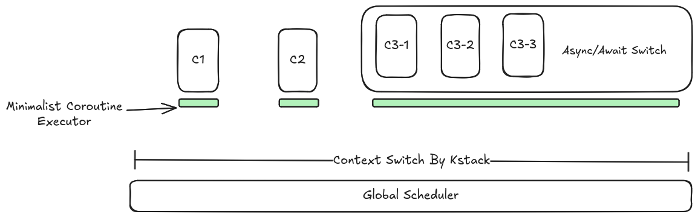

# aker-rs 内核协程 - 调度器框架


## 问题：工作队列阻塞 & 线程膨胀


当系统中的任务比较多，并发需求比较大的时候，一个比较简单的办法是额外增加线程执行流的数量，但是此方法缺点也很明显：

- 资源上，消耗比较多内存资源（尤其是内核栈）；
- 调度上，数量的增多也给调度器带来压力；
- 性能上，上下文切换次数也会变多，锁压力也会变大；

我们在实际场景中遇到最明显的问题是：

工作队列堵塞问题：

我们为每一个 CPU 都绑定了一个工作队列线程，该线程执行

```c
// 反复从任务队列中取出一个任务并执行
for(;;)
{
    task = get_task(&task_queue);
    do_task(task)
}
```

我们把中断下半部可能需要睡眠的工作，以及一些小任务，直接托付给工作队列完成。但是一旦某个任务执行中需要睡眠等待时，就会挂起整个工作队列线程，导致整个队列的堵塞，这完全无法忍受。


## 方案一：有栈纤程（C 环境下的实践）

最初这个解决方案（环境是C内核）采用了类似于有栈纤程，最后的代码形式类似于Go的Goroutine，所有代码写起来都是完全同步，但是底层采用纤程的切换实现当前线程尽可能不堵塞，若有其他任务的话，转而去执行，若无，则交换权力给系统调度器。待到资源到位后，被唤醒，可以在合适的时机回来继续执行。

上述初步方案的思想似乎已经解决了所有问题了。

- 缺点类似于 Goroutine，**每一个有栈纤程都需要一个自己的栈**，每次纤程切换都要进行一个上下文切换，对缓存也不是那么友好。

- 但是优点也很明显，**内核代码全是看似同步代码**，上层的调用者完全不关心什么异步同步，但是至少看起来全是同步，没有任何心智负担，创建一个新纤程和Go的关键字go一样简单。

至少，在C的环境下，采用无栈并不是一个好的选择。采用有栈，虽然带来了一定的切换开销，但是带来的便捷性是无栈远不能比的。

似乎没有说这个上述这个方案如何实现的，但是其核心思想和我们下面采用的Rust实现的无栈异步协程的思想是大略一致的。

## 方案二：Rust 无栈异步协程（纯协作式）

Rust 对无栈异步协程支持的很好，对于我们而言，似乎只需要补上一个运行时执行器就能很好的工作。

无栈异步协程天生就是协作式的，这对于需要需要反复睡眠，或者IO密集式的任务来说，很容易就能与之搭配，因为他们主动让出执行权力。

很自然的想到，把原来的所有线程都改为协程，让他们在一个很大的运行器上运行，这个运行器就是系统调度器。总体来看，具有唯一的执行流，这天然就是当前CPU持有的执行流。当某个协程等待资源而 Pending 时，直接原路退回到系统调度器，然后选择下一个任务执行，等到资源准备好后再加入队列。这样做的话，不仅听起来很美好，而且所有任务都不需要自己的栈，因为他们所有都直接共享当前 CPU 的一个栈。

但是在我们这里，遇到了一点麻烦 —— **抢占**；

协作式任务需要自己主动出让运行权力，或者说，为什么不能类似于以前那般，强制其挂起？

因为他们没有自己的栈。如果此时想挂起这个协程，去执行另一个协程，需要保存当前栈帧并切换到另一个协程的栈帧。但问题是——**这条调用栈上混合了执行器本身的帧和协程的帧。无法只挂起协程而不挂起执行器，因为它们共享同一个栈。而挂起执行器意味着整个协程组都停了，也就失去了协程切换的意义**。

```text
当执行器 poll 一个协程时，调用栈大致是：

    executor_loop()          ← 执行器的帧
      → task.poll()          ← 执行器的帧
        → future_a.poll()   ← 协程的帧
          → future_b.poll() ← 协程的帧  ← 假设在这里被时钟中断抢占

如果想"只挂起这个协程，让执行器去 poll 别的协程"，
就需要把协程的帧从栈上摘走——但它们和执行器的帧交织在一起，无法分离。

而在正常的协作式让出中，Future 返回 Pending，调用栈自然展开回到 executor_loop，
栈被干净地释放，执行器可以自由地去 poll 下一个任务。
```


似乎有一点点麻烦，但是抢占是我们必须实现的目标。尽管内核充分信任自己，但是我们也不可能让一个潜在的计算密集型的内核任务一直不下台，导致整体的拖垮。甚至一个小小的死循环就会让整个CPU核心永远停不下来，且永远切不走。

**纯无栈协作式方案无法满足内核的抢占需求，需要引入栈来支持强制上下文切换**

## 最终方案：协程组（混合模型）

为了叙述方便，我们下面采用一些约定说法：

> 把以前的线程，称为一个协程组。这个组里面第一个自带的执行流称为主协程（也就是线程默认的执行流），其余的由主协程创建的协程称为子协程。
>
> **协程组在系统调度器眼里，其实就是一个传统的内核线程**
>
> 注：**整个组实质上只有一个执行流**喔，只不过这个执行流执行起来在不同协程之间你让我我让你来实现并发。

为了支持抢占，我们不得不走起了以前的老路。**用栈，每一个协程组一个**。

系统调度器负责整个协程组的调度，也就是把以前以线程为单位，改为以一个协程组为单位。在系统调度器眼里，这个和以前的线程没什么两样。一个执行流，一个内核栈，仅此而已。一个组的地位和以前一个线程一模一样，依然就可以进行上下文切换，随意挂起睡眠。

但是在组内，里面就是纯原生的 Rust 无栈异步模型，在遇到睡眠时可以直接切换协程运行。

还有最后一个小问题，**每个组都有自己独立的执行器**，组内的协程运行器去哪里了？前面说到一个组有一个主协程，**最初我们设想：能不能让主协程像传统线程那样，直接执行主要的同步业务逻辑，只在需要并发时，才额外用执行器去跑异步的子协程？**

理论上可以做到“同异步混编”，但并不理想，存在以下问题：

1. 做不到统一主协程和子协程的任务模型。
2. 会带来严重的“异步传染性”问题（不能兼顾同步线程）

问题1很简单，我们下面讨论一下问题2。

由于一定有异步运行的协程存在，那么这些协程往下哪怕到了底层，也会调用很多异步函数。很多异步函数还会往上传染，导致整个内核很多函数都被迫染上 `async`的标记。而一些正常的同步代码就惨了，为了调用下面的一些功能，被捏着鼻子调用一些异步函数，结果一不留神，自己和上面的函数全哗啦被染上，导致代码偶尔很难编写。

有一些内核线程往往自己只做很少的事，只需要自己一个执行流执行一些功能，如果执行函数没有 `async`标记，便只能调用同步代码。

如果采用一套专门用于同步的API，或许有些地点仅仅是简单的`block_on`一下异步代码来堵住，但总归整体还是有维护压力。

所以干脆全部上异步。主协程在启动后立即进入执行器循环。也就是说，**主协程的全部职责就是运行执行器**，它本身不承担业务逻辑。所有业务逻辑——包括原本可以由"主协程"直接执行的简单任务——都统一作为异步任务提交到执行器队列中。具体细节如下：

当我们创建一个新的执行流来承担某些任务的时候，我们新创建一个协程组，并将任务包装成一个待执行的执行流结构体丢进一个执行器队列。当我们需要执行这些任务的时候，首先会通过上下文切换切换到固定的执行器的代码位置，然后这个执行器从中取出任务来执行即可。对于仅仅一个执行流，到此为止就可以了，当前，在主协程里面创建子协程加入执行器队列也是可以的。

最后，谈一下执行器的伪代码，在面向系统调度器方向，抢占切换是一种方式，也需要自己没任务时主动切换系统调度器让位。

```rust
// 协程组（内核线程）的执行器主循环
loop {
    // 1. 尝试从本组的异步队列中取出任务执行 (polling)
    if let Some(task) = run_queue.pop() {
        task.poll(); 
    } else {
        // 2. 如果组内没有可运行的协程，主动让出当前内核线程的 CPU 时间片
        yield_scheduler(); // 切回系统主调度器，换其他协程组(线程)执行
    }
}
```

---

至此，一个可用的内核协程 - 调度器框架就实现了。当然还有很多细节是需要补充的，比如协程的资源回收，waker唤醒，锁在上述各个阶段的使用，但这些就是后话了。

> TODO
> 同一进程内的协程组负载均衡
> 异步锁对于不同级别（协程组、线程之间）的加锁透明方式
> CPU 亲和性

## 架构图




