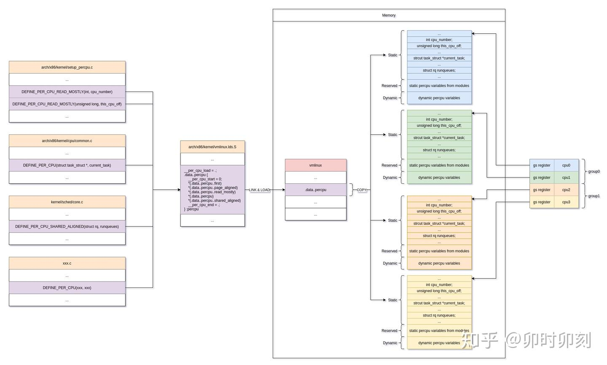

# per-CPU

我们先来直观粗略地讨论一下，对于每个CPU结构体的管理。在普通的做法中，我们很容易联想到采取一个数组进行操作。举个简单例子比方的话，类似如下：

```c
struct cpu {
    int a;
    int b;
};

struct cpu my_cpus[NR_CPUS];
```

上述方式中，每个CPU都有自己专有的结构字段，并且互不干扰，因此可以不必加锁访问。

当需要使用的时候，例如：

```c
this_cpu = my_cpus[my_cpu_id()]
this_cpu.a ++;
```


我们从抢占的角度分析，上述代码会出现几个小问题（假设我们没有其他的额外保护）：

1. 如果当前程序被抢占并且后面被迁移到其他CPU上醒来，则原有的`this_cpu`变量会失效，因为它此时相当于访问其他 CPU 的私有数据；
2. 假如另外一个任务抢占了当前的任务，且新任务如果也要修改这个变量`this_cpu.a`。那么在这同一个 CPU 上就会造成竞争；

很直接粗暴地，可以简单的采取临时`关中断`的方式，相当于原子性地处理这一块东西。此时的任务不会被调度走，便可以安安心心的。但是，为了修改 CPU 的数据，而采取关中断的方式明显又浪费了性能，因为**在此区域内 CPU 无法响应其他的中断**。

如果采取锁的形式,那么与我们的初衷**"可以在不加锁的条件下访问"**又背道而驰，且性能也会下降。


于是，我们考虑可否退而求其次，把条件减弱一点，仅仅是不允许抢占呢（此时 CPU 可响应中断）？

假设不加其他的限制，此时就算有高优先级的任务加入也不会让其逼迫下台，但典型的一个可能冲突场景是，当该任务的时间片被用完，这里的重新调度会导致进程切换，但是根据上述分析，这里不应该被调度。于是，为了解决这个矛盾，在每个 CPU 的结构体上，额外有一个抢占计数器`preempt_count`，只有`preempt_count`为0的时候（不在临界区）才允许进入调度器。 

此时的 CPU 也可以响应其他的中断，且都是在同一个 CPU 上运行。


此时的使用情况变成：
```c
cpu = get_cpu();
this_cpu= my_cpus[cpu]
this_cpu.a++;
put_cpu()
```

其中的`get_cpu`和`put_cpu`，我们给出在Linux上的相关代码示例：

```c
// include/linux/smp.h
#define get_cpu()       ({ preempt_disable(); smp_processor_id(); })
#define put_cpu()       preempt_enable()
```

其中`preempt_disable`和`preempt_enable`如下：

```c
// include/linux/preempt.h
// 这里和具体的配置有关，可以选择不同的版本。我们选择普遍的 CONFIG_PREEMPT_COUNT 和 CONFIG_PREEMPT 宏开启

#define preempt_disable()		\
do { 							\
	preempt_count_inc(); 		\
	barrier(); 					\
} while (0)


#define preempt_enable() 						\
do { 											\
	barrier(); 									\
	if (unlikely(preempt_count_dec_and_test())) \
		__preempt_schedule(); 					\
} while (0)
```


以x86中断返回内核空间为例，我们从下面代码可以看出计数器`preempt_count`的作用：

```c
// arch/x86/entry/entry_64.S
    
/* Returning to kernel space */
retint_kernel:
#ifdef CONFIG_PREEMPT
	/* Interrupts are off */
	/* Check if we need preemption */
	btl	$9, EFLAGS(%rsp)		/* were interrupts off? */
	jnc	1f
0:	cmpl	$0, PER_CPU_VAR(__preempt_count)		// 检查当前 CPU 的 preempt_count 是否为 0
	jnz	1f											// 如果非 0，说明在临界区，不允许抢占，跳过
	call	preempt_schedule_irq
	jmp	0b
1:
#endif
```

我们一并贴出`preempt_schedule_irq`：

```c
// kernel/sched/core.c

/*
 * this is the entry point to schedule() from kernel preemption
 * off of irq context.
 * Note, that this is called and return with irqs disabled. This will
 * protect us against recursive calling from irq.
 */
asmlinkage __visible void __sched preempt_schedule_irq(void)
{
	enum ctx_state prev_state;

	/* Catch callers which need to be fixed */
	BUG_ON(preempt_count() || !irqs_disabled());

	prev_state = exception_enter();

	do {
		preempt_disable();
		local_irq_enable();
		__schedule(true);		// 调度器入口 @arg: bool preempt = true
		local_irq_disable();
		sched_preempt_enable_no_resched();
	} while (need_resched());

	exception_exit(prev_state);
}
```


---


好像还没有到达我们本文档标题额额额。。。。。好吧，言归正传，我们引出`per-CPU`

上述的已经减少了一部分的数据锁定了，不过，还带来了一个问题——`cache-align`，这个是`per-cpu`显著区别于上面数组组织的方式，也是我认为引入的最主要的原因。

在 SMP 上，多个 CPU 之间的缓存要保持一致性，某个 CPU 对缓存数据进行修改，如果该缓存数据又同时存放在其他的CPU上，那么会对脏的缓存进行刷新，甚至可能造成反复的缓存抖动，对此也会带来相当的性能损失。

原来的数组结构下，CPU的结构体紧紧抱团，当前CPU的缓存里面很可能包含周围CPU的结构体，根据缓存一致性，巴拉巴拉，也许你应该懂我意思吧，哈哈。

为此，Linux引入了`percpu`，用于进一步加快 CPU 的存取操作。

大致的思路是每个 CPU 一样也都含有自己的数据副本，但是这些数据结构体不再像以前仅仅相互挨着，而是被"分开"了。`这样，在减少数据锁定的同时，一个CPU的改动就很难“波及”到另外的CPU，避免了缓存同步`。

下面我们来看下具体如何实现：


先来一张框图：

> 图片来源 知乎@卯时卯刻  https://zhuanlan.zhihu.com/p/340985476




---
---
---


TODO 


```c
// @file init/main.c @func start_kernel()
setup_per_cpu_areas() ->

// @file arch/x86/kernel/setup_percpu.c @
setup_per_cpu_areas()
{
rc = pcpu_embed_first_chunk(PERCPU_FIRST_CHUNK_RESERVE,
							dyn_size, atom_size,
							pcpu_cpu_distance,
							pcpu_fc_alloc, pcpu_fc_free);
}

// @file  mm/percpu.c
int __init pcpu_embed_first_chunk(size_t reserved_size, size_t dyn_size, 
									size_t atom_size,
									pcpu_fc_cpu_distance_fn_t cpu_distance_fn,
									pcpu_fc_alloc_fn_t alloc_fn,
									pcpu_fc_free_fn_t free_fn)
{
...
areas_size = PFN_ALIGN(ai->nr_groups * sizeof(void *));
areas = memblock_virt_alloc_nopanic(areas_size, 0);

for (group = 0; group < ai->nr_groups; group++) {                 
		struct pcpu_group_info *gi = &ai->groups[group];
		unsigned int cpu = NR_CPUS;
		void *ptr;
	
		for (i = 0; i < gi->nr_units && cpu == NR_CPUS; i++)
			cpu = gi->cpu_map[i];
		BUG_ON(cpu == NR_CPUS);
	
		/* allocate space for the whole group */
		ptr = alloc_fn(cpu, gi->nr_units * ai->unit_size, atom_size);
		...
		areas[group] = ptr;
}


for (group = 0; group < ai->nr_groups; group++) {
  │   │   struct pcpu_group_info *gi = &ai->groups[group];
  │   │   void *ptr = areas[group];
  │   │
  │   │   for (i = 0; i < gi->nr_units; i++, ptr += ai->unit_size) {
  │   │   │   if (gi->cpu_map[i] == NR_CPUS) {
  │   │   │   │   /* unused unit, free whole */                                                                           │   │   │   │   free_fn(ptr, ai->unit_size);
  │   │   │   │   continue;
  │   │   │   }
  │   │   │   /* copy and return the unused part */
  │   │   │   memcpy(ptr, __per_cpu_load, ai->static_size);
  │   │   │   free_fn(ptr + size_sum, ai->unit_size - size_sum);
  │   │   }
  │   }


// @file  arch/x86/kernel/smpboot.c
/*                                                                                * Activate a secondary processor.
*/
notrace start_secondary(void *unused) -> cpu_init() -> switch_to_new_gdt(int cpu)  ->  load_percpu_segment(int cpu)
{
	wrmsrl(MSR_GS_BASE, (unsigned long)per_cpu(irq_stack_union.gs_base, cpu));
}


#define per_cpu(var, cpu)   (*per_cpu_ptr(&(var), cpu)) 
 
#define get_cpu_var(var)                        \
(*({                                            \
    preempt_disable();                          \
	this_cpu_ptr(&var);                         \
}))


#define DECLARE_PER_CPU(type, name)                 \    
	DECLARE_PER_CPU_SECTION(type, name, "")
#define DEFINE_PER_CPU(type, name)                  \                 
	DEFINE_PER_CPU_SECTION(type, name, "")


```


`DEFINE_PER_CPU(type, name)`
`DECLARE_PER_CPU(type, name)`

`get_cpu_var(name)`
`per_cpu(name,cpu)`

`alloc_percpu(type)`
`__alloc_percpu(size_t size, size_t align)`
`free_percpu(const void *)`

``